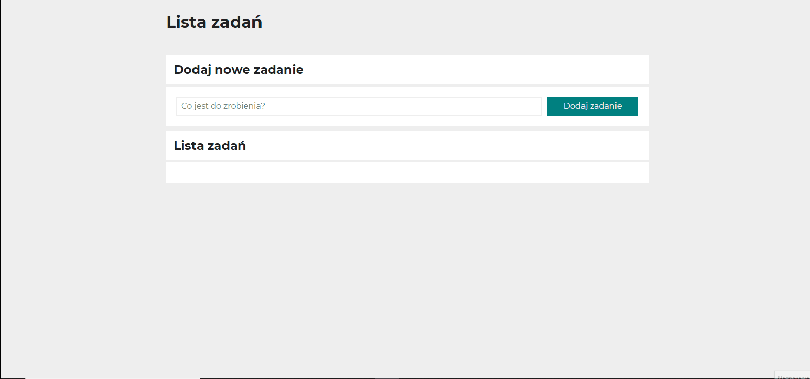

# Kasia Napierała - TODO-LIST

## Demo

https://klarma.github.io/TODO-LIST/

## Description

The TODO-LIST application is a simple but very practical project based on js. It contains *BEM, Grid, ES6+ features: const, let, bloki, arrow functions*. I don't use more advanced solutions but instead ** I pay attention to details when writing the code and the ability to work in accordance with good practices **. The correctness of my work is supervised by [Krzysztof Dąbrowski](https://www.linkedin.com/in/dabrowskisoftware) - an experienced Senior Software Engineer.

## How to use 

Enter the task you want to add to your task's list. Click the "Dodaj zadanie" button and you will see it at the bottom of the application as an another element of the list. 

If you want to pick your task as done click the green icon. If you want to change your mind click the green icon again. 

If you want to delete your task click the red icon. 

Enjoy my application!